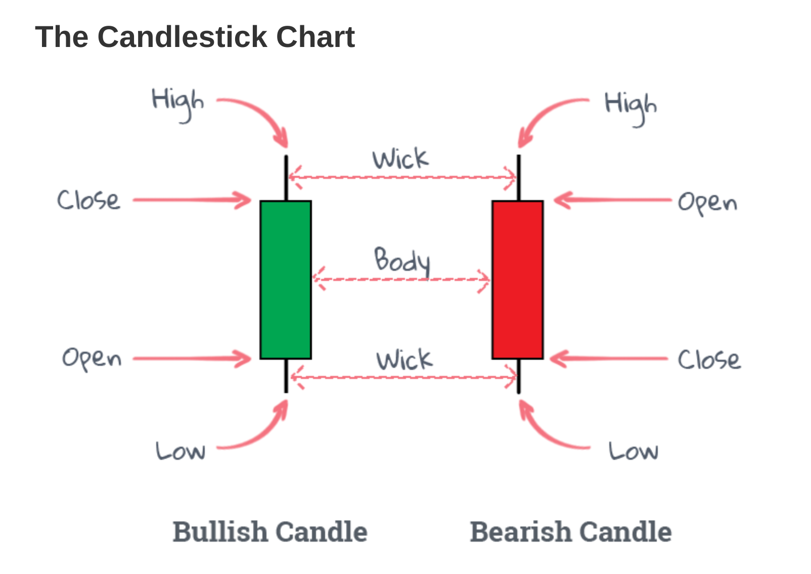
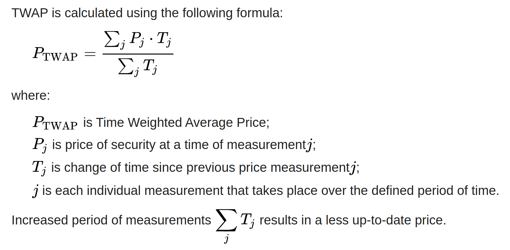
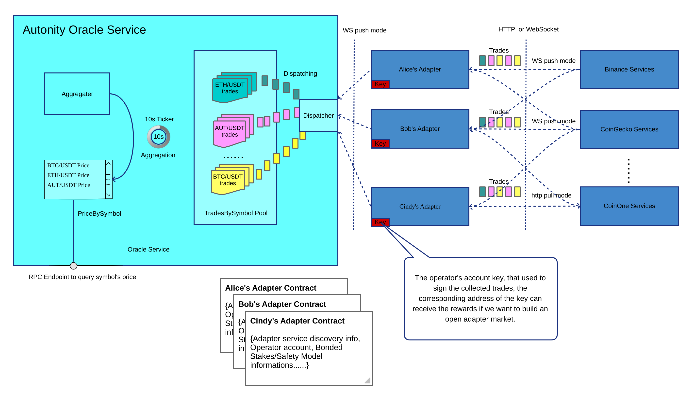

# Autonity Oracle Component 

## Assumptions 

Details runtime and operating system dependecies. 

This project assumes the following:

* Go 1.8 
* Linux / MacOS operating system

## Installation 

How to install the software and any dependencies required

Example

This project uses go modules. To install the project run

    go mod

## Configuration 

Details how to configure the component, including examples of configuration files.

Example

The project uses a JSON configuration file. An example file is given at
`config.example.json`.  To use this template to create an `example.json` file
and update the values according to your environment. 

## Developing

This covers details of how to run tests and any workflows

Example
    
To run tests use
    
    make test

To generate code coverage reports run

    make coverage

To lint code run

    make lint

To build the project run

    make build

## Deployment

Details on where to find software artefacts and the packaging formats supported. 

Example

This product ships as a docker image, debian and rpm packages. Artefacts may be found at `repos.clearmatics.com`. For details of how to access artefacts please consult the DevOps team. 

## Product documentation 
This product brings extensive currency exchange rate from both major crypto markets and fiat money markets. And expose a HTTP RPC end points to provide those data service.

## Definitions
### Data providers in this component
Crypto data providers include both centralized or decentralized exchanges, for example an AMM, Binance, Bitfinex or CoinGecko...    
Fiat money data providers include traditional finance data providers, for example AlphaVantage.

### Kline and Candlestick
For Kline and Candlestick please refer to [here](https://medium.com/cryptocurrencies-ups-and-down/master-k-line-charts-and-its-patterns-are-essential-for-financial-success-9d9b0f49b68d).   


### Symbol
The symbol in this component usually represents a currency pair, for example:
```typescript
  symbols: [
    'BTC/USDT',
    'ETH/USDT',
  ]
```

### Trade metadata in this component
For those trade metadata returned by crypto exchanges are usually aggregated in a candlestick pattern. For example:
```typescript
// the trade event pushed by web socket protocol of Binance.
interface CandlestickStreamData {
  e: string // Event type
  E: number // Event time
  s: string // Symbol
  k: {
    t: number // Kline start time
    T: number // Kline close time
    s: string // Symbol
    i: string // Interval
    f: number // First trade ID
    L: number // Last trade ID
    o: string // Open price
    c: string // Close price
    h: string // High price
    l: string // Low price
    v: string // Base asset volume
    n: number // Number of trades
    x: boolean // Is this kline closed?
  }
}
```

```typescript
  /**
   *
   * a trade event pulled from Binance's ticker http endpoint
   *
   * {
   *   "symbol": "CELOBTC",
   *   "priceChange": "0.00000023",
   *   "priceChangePercent": "0.281",
   *   "weightedAvgPrice": "0.00008154",
   *   "prevClosePrice": "0.00008173",
   *   "lastPrice": "0.00008219",
   *   "lastQty": "7.10000000",
   *   "bidPrice": "0.00008213",
   *   "bidQty": "9.90000000",
   *   "askPrice": "0.00008243",
   *   "askQty": "100.00000000",
   *   "openPrice": "0.00008196",
   *   "highPrice": "0.00008386",
   *   "lowPrice": "0.00007948",
   *   "volume": "155146.90000000",
   *   "quoteVolume": "12.65048684",
   *   "openTime": 1614597075604,
   *   "closeTime": 1614683475604,
   *   "firstId": 849549, // First tradeId
   *   "lastId": 854852, // Last tradeId
   *   "count": 5304 // Trade count
   * }
   */
```
## The component structure design
### Key data structure

#### Trade
A trade structure contains trade information for a certain symbol aggregated by a data provider during a time period.     
While the aggregation in this component is base on a sequences of trades which have a timestamp that is within 3 minutes comparing current time in the oracle service. We assume node is in sync with NTP.
```typescript
export interface Trade {
  timestamp: number
  price: BigNumber
  volume: BigNumber
}
```
#### Trades
A slice of trade
```typescript
type Trades = Trade[]
```
#### TradesBySymbol
A mapping from symbol to a sequences of trades.
```typescript
export interface TradesBySymbol {
  [symbol: string]: Trades
}
```
#### PriceBySymbol
A mapping from symbol to the final aggregated price which is used for querying the latest price of a symbol.
```typescript
export interface PriceBySymbol {
  [symbol: string]: BigNumber
}
```

### Timing and Workflows


#### Trade data synchronization
The trade data synchronization have two modes, the push mode and pull mode. For those data provider who provide websocket based protocol, they can push those trades to the subscriber, while for those who only provide https protocol to query the latest trades, a pull mode is used.   

In the startup phase, each adapter with configured symbols, they firstly pull those latest trades of per symbol from provider via https to fill the empty trades pool. Then if the provider supports a push mode via web socket, then the adapter subscribe the trade event, otherwise it would use a pull mode to fetch trades in a fixed interval(10s) from provider.    

Once the adapters get new trades from provider, they unify them into the Trade{timestamp, price, volume} and dispatch them into the trades pool by symbol.

#### Timing for data aggregation
A 10s ticker is used to trigger the data aggregation from aggregator, the aggregator will observe if there are new trades added for per symbol since last aggregation. If there are new trades, it starts the aggregation and update the price in the priceBySymbol pool.  

For the timing being, the TVWAP_PERIOD is 3 minutes, that means only those trades with an age of less 3 minutes are valid for data aggregation.

### TVWAP Aggregation Algorithms
#### TWAP
    

#### VWAP


Here is an example in typescript:
```typescript

export function tvwap(
  array: { price: BigNumber; volume: BigNumber; timestamp: number }[],
  minimumTimeWeight: BigNumber = num(0.2)
): BigNumber {
  if (!array || !array.length) {
    throw new Error('empty array')
  }

  if (array.length === 1) {
    return array[0].price
  }

  const sortedArray = array.sort((a, b) => a.timestamp - b.timestamp)
  const now = num(Date.now())
  const period = now.minus(num(array[0].timestamp))
  const weightUnit = num(1).minus(minimumTimeWeight).dividedBy(period)

  const tvwapTrades = sortedArray.map((trade) => ({
    price: trade.price,
    // volume: trade.volume * (((1 - minimumTimeWeight) / period) * (period - (now - trade.timestamp)) + minimumTimeWeight)
    volume: trade.volume.multipliedBy(
      weightUnit.multipliedBy(period.minus(now.minus(num(trade.timestamp))).plus(minimumTimeWeight))
    ),
  }))

  return vwap(tvwapTrades)
}

export function vwap(array: { price: BigNumber; volume: BigNumber }[]): BigNumber {
    if (!array || !array.length) {
        throw new Error('empty array')
    }

    if (array.length === 1) {
        return array[0].price
    }

    // sum(volume * price) / (total volume)
    // return array.reduce((s, x) => s + x.volume * x.price, 0) / array.reduce((s, x) => s + x.volume, 0) || 0
    const sum = array.reduce((s, x) => s.plus(x.volume.multipliedBy(x.price)), num(0))
    const totalVolume = array.reduce((s, x) => s.plus(x.volume), num(0))
    return sum.dividedBy(totalVolume) || num(0)
}
```
### A more decentralized thinking
To decouple those adapters from oracle component, it is possible to run those adapter independently by unifying the interface between oracle server and adapter.    


#### An on-chain adapter hub contract
An on-chain adapter hub contract is used to manage those adapter's digital twins where it contains the service discovery information, the operator account, the state of the adapter, and staking information...    
Oracle service can query those on-chain digital twins of available adapters, and subscribe trade events via the service discovery information. Those adapters just need to push trades to the describers.

#### The trade events signature
The trade events pushed by adapters were signed the by corresponding private key of the operator account registered, so it is easy to apply incentives over the service provider.

* [SRS][1]
* [SDD][2]
* [User Documentation][3]

[1]: https://platform.clearmatics.net/docs/srs/004/index.html
[2]: https://platform.clearmatics.net/docs/sdd/001/index.html
[3]: https://magneto.clearmatics.com/
